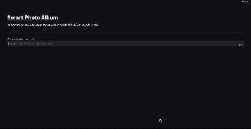

# Smart Photo Gallery




This is a photo gallery app, powered by Apple Silicon (MPS), that lets you **search semantically** your photos in your local folder using artificial intelligence. You can find their visual content in seconds by typing text like "red car" or "dog running on the beach".

##  Technologies Used

* **Artificial Intelligence (Visual Processing):** [OpenCLIP](https://github.com/mlfoundations/open_clip) (MPS/Metal-supported zero-sample inference)
* **Vector Database:** [ChromaDB](https://www.trychroma.com/) (HTTP API Server)
* **User Interface:** [Streamlit](https://streamlit.io/)

* **System & Orchestration:** Python `watchdog`, `threading`, `subprocess`

## Installation and Operation

After installing the necessary packages, you can start the entire system (Database server, background workers, and web interface) with a single command:

```bash
# 1. Install dependencies
pip install -r requirements.txt

# 2. Run the application start
python main.py